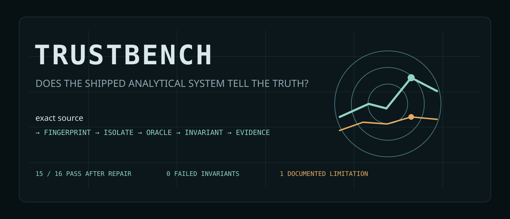
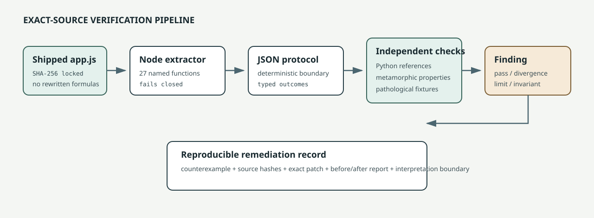

<p align="center">
  
</p>

# TrustBench

**Executable evidence for whether analytical systems are telling the truth.**

TrustBench extracts selected algorithms from the *exact shipped source* of an analytical product, fingerprints that source, compares results with independent numerical references, and probes invariants that example-based unit tests often miss.

The first subject is the browser-side statistical engine inside **EDA InsightLab Apex**. The first controlled cycle preserves both the uncomfortable baseline and the post-repair result:

| Same 16 checks | Uploaded source | Apex v1.0.1 |
|---|---:|---:|
| Pass | 7 | **15** |
| Definition divergence | 2 | **0** |
| Limitation | 4 | **1** |
| Failed invariant | 3 | **0** |
| High-priority non-pass | 4 | **0** |

Baseline SHA-256: `a15f8c9830c2729392e02e54abe2c62a3caba885b08f3aba8b575d522a2ef395`  
Apex v1.0.1 SHA-256: `51a9853d2a465a71197a28e71d16821d69b3cbbebf6c1bdc753563c12a3688df`

[Baseline report](evidence/reports/apex-a15f8c9830c2.md) · [Post-repair report](evidence/reports/apex-51a9853d2a46.md) · [Remediation case study](docs/REMEDIATION_CASE_STUDY.md) · [Exact patch](evidence/patches/apex-v1.0.1-statistical-correctness.patch)

<p align="center">
  
</p>

## What the controlled cycle established

The baseline agreed with independent references for several core operations, but it also reproduced four high-priority risks: silent data loss from duplicate CSV headers, encounter-order-dependent Cramer's V, target-insensitive categorical ranking for numeric outcomes, and an exact target proxy escaping the leakage guard. It separately identified estimator and PCA operation-order divergences plus bounded identifier/PCA behavior.

The repair changed only the subject implementation. The same suite then reported 15 passes, zero definition divergences, one low-severity limitation, zero failed invariants, and zero high-priority non-pass findings. The remaining limitation is explicit: the missing-token vocabulary is deterministic but not configurable by dataset or column.

This before/after design matters more than a polished final number. TrustBench preserves the original counterexamples, exact source hashes, reference outputs, patch, and interpretation boundaries so the improvement can be challenged and reproduced.

## Why this is not another test wrapper

TrustBench has three separable layers:

```text
subject source
  -> content fingerprint
  -> exact function extraction into an isolated Node VM
  -> deterministic JSON protocol
  -> independent Python oracles
  -> golden + differential + metamorphic checks
  -> Markdown and JSON evidence
```

The Apex adapter does **not** paste or reimplement the subject formulas. It extracts 27 named functions from the supplied `app.js`; extraction fails closed when expected anchors disappear. Python and Node independently hash the input before results are accepted.

## Reproduce the controlled transition

Prerequisites:

- Python 3.11 or newer
- Node.js 22 or newer
- dependencies from `requirements-lock.txt`

The two exact subject snapshots are bundled and content-locked, so the core result requires neither a network fetch nor a sibling checkout:

```bash
python -m venv .venv
source .venv/bin/activate
python -m pip install --requirement requirements-lock.txt
python -m pip install --no-deps -e .
make verify
```

`make verify` fingerprints both snapshots, runs the framework suite, executes the baseline and hardened JavaScript through the Node VM adapter, compares freshly generated evidence with the retained reports, verifies the transition manifest, and checks for generated residue.

To inspect only the before/after reports:

```bash
make transition
```

An external Apex source can still be supplied explicitly:

```bash
./scripts/verify_delivery.sh /path/to/EDA-InsightLab-Apex/assets/js/app.js
```

The optional locked fetch helper rejects downloaded content whose SHA-256 differs from its reviewed target. The bundled snapshots remain the authoritative offline reproduction path.

## Verification taxonomy

TrustBench avoids reducing every disagreement to “test failed.”

| Classification | Meaning |
|---|---|
| **Pass** | Subject and reference agree for the declared fixture and tolerance. |
| **Definition divergence** | The subject uses a different estimator or operation order that must be named and defended. |
| **Limitation** | Behavior is deterministic but materially bounded, implicit, or unsafe outside a narrow scope. |
| **Failed invariant** | A mathematical, ingestion, or metamorphic property is violated. |

This distinction matters. Multiple skewness estimators can be defensible; a categorical association score changing solely because rows were reordered is not.

## Repository map

```text
adapters/apex_runtime.mjs       exact-source extractor and JSON bridge
src/trustbench/apex.py          subprocess boundary and fingerprint checks
src/trustbench/oracles.py       independent numerical references
src/trustbench/cases.py         executable differential/metamorphic suite
src/trustbench/reporting.py     Markdown and JSON evidence generation
tests/                          oracle, adapter, fail-closed, and report tests
subjects/apex/snapshots/         locked baseline and hardened source
subjects/apex/*.lock.json         reviewed subject fingerprints
evidence/reports/               baseline and post-repair generated evidence
evidence/patches/               exact subject repairs
evidence/transitions/           machine-readable before/after manifest
docs/                           architecture, methodology, research, limits
```

## Current boundaries

This first slice verifies selected browser-side statistics and feature-selection/PCA behavior. It does not yet certify the full UI, browser compatibility, accessibility, transformation lineage, generated Python equivalence, large-file performance, or model validity. Passing fixtures are evidence, not proof over all possible datasets.

The next technically justified expansion is **transformation-fidelity testing**: execute browser transformations, exported JSON, generated Python, and final CSV as four representations of one pipeline, then check semantic equivalence under pathological datasets. The remaining missing-token limitation should also become a configurable, lineage-recorded semantic contract.

## Design principles

- test shipped behavior, not README intent;
- fingerprint every subject and environment;
- use reference libraries where definitions are stable;
- use metamorphic properties where a single oracle is insufficient;
- preserve counterexamples and operation order;
- separate mathematical error from documented trade-off;
- make every public claim reproducible from one command.

## License

MIT. Subject software retains its own license and provenance.
