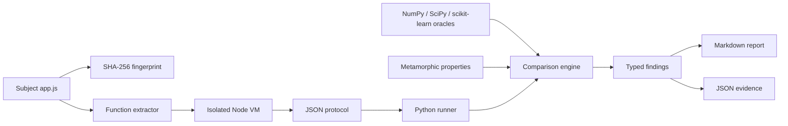

# Architecture

## System boundary

TrustBench treats an analytical product as a **subject**, not as a dependency to import blindly. A subject adapter is responsible for reaching the actual implementation while preserving source identity.

## Components

### Exact-source Apex adapter

`adapters/apex_runtime.mjs` reads a caller-supplied `app.js`, extracts 27 expected declarations, and evaluates them in `node:vm`. It provides operations for profiling, feature selection, categorical association, and PCA through one JSON request/response boundary.

The adapter fails closed when:

- the source file is absent;
- a required declaration cannot be found;
- evaluation fails;
- an operation is unsupported;
- the JSON response is malformed;
- Python and Node fingerprints disagree.

### Python execution boundary

`ApexAdapter` invokes Node with a finite timeout and captures stdout/stderr. The source is hashed again in Python. This makes the subject language independent from the oracle language and prevents accidental calls into a rewritten Python copy.

### Reference oracles

`oracles.py` contains small, explicit interfaces over established numerical implementations. It names choices that are often left implicit:

- NumPy linear interpolation for quartiles;
- `ddof=1` for sample standard deviation;
- pairwise-complete Pearson correlation;
- raw and bias-corrected Cramer's V;
- full-SVD PCA after mean imputation and scaling.

### Finding model

Every finding has an identifier, area, status, severity, tested claim, observed result, reference result, evidence, and engineering recommendation. Markdown and JSON are generated from the same typed object, reducing narrative drift.

## Trust boundaries

The Node VM isolates the extracted functions from the browser DOM, but it is not a hostile-code sandbox. Only reviewed local subject code should be executed. The adapter is intentionally not a generic remote JavaScript evaluator.

## Change detection

The subject lock contains a file SHA-256. The uploaded ZIP did not include Git metadata, so the current artifact cannot truthfully claim a pinned commit. Before publication, resolve the public commit SHA and add it alongside the content hash.
